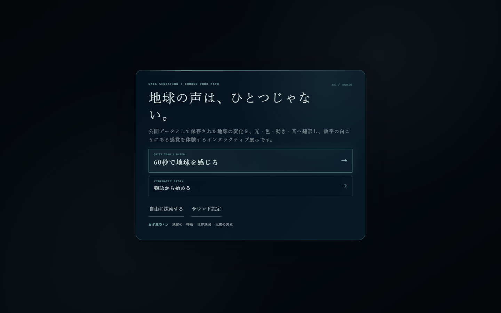

# 惑星の放課後

**GAIA SENSATION**

[](https://github.com/hinahina-vr/gaia-senseware/actions/workflows/contest-checks.yml)

公開データとして保存された地球の変化を、光・色・動き・音へ翻訳し、数字の向こうにある感覚を体験するインタラクティブ展示です。

## 5分で審査する順序

1. [30秒ガイドを開く](https://gaia-senseware.pages.dev/#tour) — 地図操作、年代比較、変換過程、宇宙観測を実画面で確認
2. [公開サイトを最初から開く](https://gaia-senseware.pages.dev/) — キービジュアル、映画的オープニング、スマートフォン対応を確認
3. 地図の `OPEN DATA` と `CODE` — 元の値、計算、色・光・動きの対応を確認
4. [GitHub](https://github.com/hinahina-vr/gaia-senseware) — Vanilla JavaScript実装、テスト、データ生成コードを確認

応募情報の全体は[2026夏コンテスト提出ガイド](docs/CONTEST_2026_SUBMISSION.md)、主要モジュールとイベントは[アーキテクチャ](docs/ARCHITECTURE.md)にまとめています。

| PC | スマートフォン |
|---|---|
|  |  |

### データが表現になる例

| 区分 | 「地球の一呼吸」で表示するもの |
|---|---|
| `○ SOURCE / 公開記録` | NOAA・GOSAT・NASAが公開したCO₂濃度、気温偏差、日時、単位 |
| `△ DERIVED / 計算・補間` | 欠測補完、観測時点間の線形補間、表示用の正規化。式と加工有無を併記 |
| `◇ SCENARIO / 仮定・操作` | 年代スライダーによる試算や観客操作。観測値とは分けて表示 |
| `VISUAL / 表現` | CO₂を明るさと呼吸速度、気温偏差を青から赤の色へ変換 |

### 実装と検査

基本体験はHTML、CSS、JavaScript、WebGL 2、Canvas 2D、ブラウザ標準APIだけで成立し、ブラウザへ外部JavaScriptランタイムライブラリを配信しません。通常展示は取得済みスナップショットで完結し、地図内のライブ展示09〜12だけが、機能フラグ有効時にPages Worker経由でNOAA・JAXA・ESAの公開観測へ接続します。取得元・公開状態・観測時刻は各ライブ展示の主表示にまとめています。

```powershell
npm run check
npm run check:contest
npm run check:rights
npm --prefix sensor-platform run typecheck
npm --prefix sensor-platform run check:pages-worker
npm --prefix sensor-platform run test:pages
```

GitHub Actionsの `Contest checks` は実Google Chrome、Web、センサー型、Pages Worker、ローカルD1を検査し、デプロイは行いません。出典・素材権利は[提出ガイド](docs/CONTEST_2026_SUBMISSION.md#データ出典)、[権利台帳](docs/MEDIA_RIGHTS_LEDGER.md)、作品内の `OPEN DATA` に記録しています。背景・キャラクターはOpenAI ImageGen、音楽は主にSuno AI（地図展示専用曲はリポジトリ内の純粋なNode.js合成）、地図はNatural Earth Public Domainです。

> 物語・キャラクター・GX・演出方針の正本は
> [`docs/GAIA_SENSEWARE_GX_OFFICIAL_SETTING.md`](docs/GAIA_SENSEWARE_GX_OFFICIAL_SETTING.md) を参照してください。

## 8つの感覚器

| # | 感覚器 | 主な公開データ | 画面への変換 |
|---|---|---|---|
| 01 | **地球の一呼吸** | GOSAT / NOAA / NASA GISTEMP | CO₂の季節変化を動きに、長期的な増加を明るさに、気温差を背景色にする |
| 02 | **青い循環系** | NOAA CoastWatch / NASA POWER | 海流の速さと、同じ流れが14日続いた場合の移動距離を表示する |
| 03 | **森の気候装置** | NASA MODIS / NASA POWER | 土地の種類に、世界31地点の平均的な雨の量を重ねる |
| 04 | **すべては次の資源** | UN SDG 12.5.1 | 国ごとの現在値を比べ、選んだ国に自分の改善目標を置く |
| 05 | **人類世の傷跡** | EDGAR / NASA VIIRS | 夜の明かりを白、国ごとの温室効果ガス排出量を赤で重ねる |
| 06 | **地球からのメッセージ** | 気象庁 / USGS | 世界の大地震と、日本各地で実際に記録された震度を表示する |
| 07 | **三つの生態系** | NASA MODIS / World Bank / UNESCO | 森林、都市人口、各地域から選んだ世界遺産を三層で表示する |
| 08 | **人工物の共生化** | NASA POWER / World Bank | 日差しや風と、現在の再生可能電力の割合を見比べる |

三幕構成は **循環を知る → 人間の影響を見る → 関係を編み直す** です。
各章の解説では、画面の見方、触ったときの変化、参照した「共創地球論」の授業を紹介します。

## ORBITAL — 宇宙を読む10の観測窓

入口の第4モードです。NASA DONKIの太陽フレア・CME・磁気嵐・高エネルギー粒子、
NASA/JPL CNEOSの小惑星接近・火球、NASA Exoplanet Archiveの系外惑星、
ISAS/JAXA DARTSのはやぶさ2 LIDARを、一つのローカルJSONへ保存しています。

| # | 観測窓 | 主な公開データ | 画面への変換 |
|---|---|---|---|
| 01 | 太陽の閃光 | NASA DONKI FLR | フレア等級を、開く光の大きさにする |
| 02 | 太陽風の波 | NASA DONKI CME | CME解析速度を、広がる円弧の速さにする |
| 03 | 磁気圏の嵐 | NASA DONKI GST | 最大Kp指数を、磁力線の揺れにする |
| 04 | 太陽から届く粒子 | NASA DONKI SEP | イベント通知を、細い粒子の雨にする |
| 05 | 地球をかすめる小惑星 | NASA/JPL CNEOS CAD | 最接近距離を、地球をかすめる軌道へ変換する |
| 06 | 大気に燃える火球 | NASA/JPL CNEOS Fireball | 推定衝撃エネルギーを、流星の残光にする |
| 07 | 近くの惑星系 | NASA Exoplanet Archive | 地球からの距離を、同心円上の位置にする |
| 08 | 地球サイズの遠い世界 | NASA Exoplanet Archive | 半径と平衡温度を、円の大きさと色にする |
| 09 | リュウグウに触れる光 | ISAS/JAXA DARTS LIDAR | 表面中心からの高さを、小惑星輪郭の凹凸にする |
| 10 | 宇宙の感覚神経系 | 01〜09の資料 | 単位を合算せず、別々の信号を神経網へ置く |

宇宙モードの `DATA / SOURCE` では、提供機関、URL、取得時刻、期間、単位、加工、注意点、
先頭10行を確認できます。閲覧中はAPIへ接続せず、`data/space-signals.json`だけを読みます。
スナップショットを更新するときだけ `npm run data:space` を実行します。

## データの開示原則

- `SOURCE` — 公開データそのもの
- `DERIVED` — 正規化・補間・集計した値
- `SCENARIO` — 観客入力または明示した仮定による仮想状態
- ライブ観測は `NEAR REAL TIME`、`LATEST PUBLISHED`、`STALE`、`SNAPSHOT` を値ごとに表示
- 地図の `OPEN DATA` には、**現在の演出に関係するデータだけ**を表示
- 提供機関、URL、取得日、期間、単位、空間・時間解像度、加工内容、注意事項、先頭10行を表示
- `CODE` は `VISUAL CODE / DATA TRANSFORM / RAW DATA` の3タブ
- 統計補完は元の`SOURCE`を上書きせず、補完値へ`DERIVED`、未来投影へ`SCENARIO`を付ける
- `OPEN DATA`の`STATISTICS`欄で、式、採用条件、検証法、限界、画面上の区別を表示
- 通常展示の描画は `data/gaia-signals.json` などの取得済みスナップショットだけを使用
- Live Sensewareは地図のライブ展示09〜12に置き、NOAA NDBC、NOAA GML、JAXA GSMaP、ESA Sentinel-5Pを別の地点・期間として各展示の主表示に明記
- ライブ取得失敗時は最後の正常値、続いて版管理スナップショットへ退避し、ライブ値を装わない
- OSCAR取得タイムアウト時の02は、台帳に明記してNOAA CoastWatch Blended NRT海流へ代替

## 作品のしくみ／応募規約展示

入口画面の `データが光になるまでを見る` から、ImageGenで制作したシステム構成図を開けます。
その下には、データの取得、作品内への保存、計算、描画までを短い文章でも説明しています。

図版とは別に、HTML／CSS／JavaScriptによる実装、外部JavaScriptライブラリ不使用、
Public GitHubリポジトリとホスティングの同一性、PC・スマートフォン版Chrome対応、
審査用ローカルデータ・スナップショットについて文章で明記しています。

同じ展示の `GOSATって何？ データをやさしく紹介` では、GOSAT、NOAA、NASA GISTEMP、
NOAA CoastWatch、NASA POWER、MODIS、VIIRS、国連SDG、EDGAR、
World Bank、気象庁、USGS、UNESCOを平易な言葉で紹介します。データの一般的な説明と、
この作品でどの色・線・粒子へ変換したかを分け、各公式ページへのリンクも掲載しています。

## 統計学との接続 — 欠測補完と未来投影

授業で扱う「欠測の種類」「代表値」「回帰」「誤差評価」を、そのまま作品の表示規則にしています。
数値が空いているから自動的に埋めるのではなく、補完可能な数値欠測と、埋めてはいけない構造的欠測を分けます。

### 1. GOSAT空間欠測 — 8近傍IDW

GOSAT閲覧画像から復元した各時点の2.5°格子には、10,368セル中4,125〜6,580セルの欠測がありました。
欠測セル` s `について、球面上で近い観測8セルを選び、距離の2乗の逆数を重みにした
**k近傍・逆距離加重法（IDW）**で補完します。

```text
x_hat(s) = Σ[d_i^-2 × x_i] / Σ[d_i^-2]    k = 8
```

経度は±180°で循環させ、観測済みセルは上書きしません。各時点から最大128観測セルを意図的に隠して
同じ式で推定するホールドアウト検証を行い、現在のスナップショットではRMSE 0.214〜0.610 ppm、
MAE 0.145〜0.266 ppmでした。これは表示格子内の補間誤差であり、衛星測定そのものの不確実性ではありません。
補完セルは低い不透明度と斜線で表示し、タップ時にも`DERIVED / SPATIAL IDW`と明示します。

### 2. GOSAT時点間 — 線形内挿

収録した二つのGOSAT時点`t0, t1`の間は、時間比率`a`による線形内挿です。

```text
x_hat(t) = (1 - a) × x(t0) + a × x(t1)
```

これは観測時点間だけに用いる`DERIVED`で、観測期間外の未来へは使いません。急激な局地変化を表せない
単純モデルであることを、データ台帳と`DATA TRANSFORM`に残します。

### 3. 2026〜2050 CO₂ — 最小二乗トレンド投影

NOAA Mauna Loaの季節調整済み月平均から直近120か月（2016-07〜2026-06）を使い、時間だけを説明変数にした
**通常最小二乗法（OLS）**を当てます。

```text
y_hat(t) = y_bar + beta_1 × (t - t_bar)
```

現在の同梱スナップショットでは、傾き`beta_1 = +2.5385 ppm/年`、`R² = 0.9954`、
残差標準誤差`0.5007 ppm`です。2050年の中心値は`489.1 ppm`、線形モデル内の95%予測区間は
`487.7〜490.4 ppm`です。ただし、この区間は「同じ線形関係と誤差構造が続く」という仮定の内部だけの幅で、
将来の政策、排出経路、吸収源の変化、気候フィードバックは含みません。そのため作品では気候モデルの予測ではなく、
`SCENARIO / OLS TREND PROJECTION`と呼びます。

### 4. 廃棄物統計 — 地理的5近傍中央値

UN SDG 12.5.1の公式値がある17地域は`SOURCE`の実線円です。未収録14地域は、代表座標から近い
公式値保有5か国の再資源化率の**中央値**で補完します。中央値を使うのは、平均より極端値の影響を受けにくいためです。
ただし地理的近さは制度、所得、廃棄物定義を説明しないので、補完値は`DERIVED`の破線円とし、国別順位や政策評価には
使いません。POIにはドナー国、最大ドナー距離、中央値絶対偏差（MAD）を表示します。

### 補完しない欠測

気象庁観測点の開設前・終了後などは、ランダムな数値欠測とは見なしません。観測制度やデータ生成過程に由来する
**構造的欠測**として残します。「計算できる」と「推定してよい」を分けることも、この作品における統計学の役割です。

## MAP LENS — 世界のデータを見る

`MAP`を開くと、Natural Earth 1:50mの陸地形状を、経度・緯度に合わせて一枚に収めた世界地図へ移動します。
左下（スマートフォンでは画面下部）の`INSTALLATION BANK / 01—08`で、同じ惑星へ重ねる感覚器を切り替えます。

世界地図には、選択中の感覚器に対応するCO₂分布、海流、風、降水、
エネルギー条件などを重ねます。USGS震源は06の`SNAPSHOT`だけで表示します。
大陸の輪郭は、Natural Earth 1:50m Landの60,669座標点を収めた同梱GeoJSONからCanvasへ描画します。
世界モードでは横方向の反復を行わず、南極を含む一枚の地球として表示します。簡略な予備モデルは、
Natural Earthを読み込めなかった場合だけの非常用です。

01のCO₂ヒートマップは約60秒で1958年から2050年までを自動再生します。1958〜2009年は
NOAA Mauna Loaの実測濃度水準へ最古GOSATの空間模様を移した`DERIVED`再構成です。2010〜2025年は
GOSAT公式画像から復元した16時点を使い、空間欠測を8近傍IDW、時点間を線形内挿します。
2026〜2050年はNOAA直近120か月のOLSトレンド投影を`SCENARIO`として示し、線形モデル内の95%予測区間も
表示します。政策・排出経路を含む気候モデル予測ではありません。比較色は全期間共通の300〜500 ppm固定尺度です。
セル選択中は停止し、閉じるとその時点から再開します。

02はNOAA CoastWatchの日別海面流u/vスナップショットから、0〜14日の計算上の移動を約45秒で
自動再生します。青〜橙の色は0〜1.5 m/sの固定流速尺度、シアン線は各地点のu/vが一定なら
表示中の日数で進む実距離、白矢印はNASA POWERの年平均風です。観測点間を補間して海全体を
塗らず、海流と風も混合しません。移流線は単一日のベクトルを一定とした`DERIVED`な思考実験で、
将来の海況予測や漂流予報ではありません。観測点選択中は停止し、u/v・流速・計算距離を表示します。

03〜08は一律の架空年表にせず、各データに合った約48秒のシーケンスです。03は31降水地点、
04は17地域の公式値＋14地域の補完値、05は31か国、06は世界の142件から年代別に選んだ24件、
07は三層と全層、08は31地域を順に表示します。スライダー操作後は8秒停止し、POIの説明を
開いている間も停止します。SOURCEの観測・統計値、DERIVEDの表示計算、SCENARIOの仮想状態は
大型ラベルと凡例でも区別します。

06で表示される `HISTORY` レイヤーには、気象庁「震度データベース検索」から選んだ
最大震度6弱以上の代表6地震を収録しています。地震を選ぶと、水色のP波リングが7 km/s、
橙のS波リングが4 km/sの代表速度で、1秒=1秒の実時間として進みます。S波の計算到達に合わせ、その地震で震度6弱・6強・7を
実際に観測した全地点が黄・橙・赤紫で現れます（6地震・273地点）。震度は
マグニチュードから推定した値ではありません。

P/Sリングは、気象庁の一般向け解説にある代表速度（P波 約7 km/s、S波 約4 km/s）を使います。
震央から観測点までの地表距離と震源深さから直線的な震源距離を求めますが、実際の速度は
地質・深さ・経路で変わります。このため、実時間スケールの代表速度モデルであり、観測された
到達時刻や緊急地震速報の予測ではありません。
地震やPOIのない場所に触れると、近い地域へ緑の波が広がります。これは観客の操作を示す演出で、
地震波や観測データではありません。

`SNAPSHOT` レイヤーでは、USGSから取得して作品へ同梱した2000年以降・M7.5以上の世界の震源を
Natural Earthの世界地図に重ねます。閲覧中にUSGS APIへ接続したり、値が更新されたりすることはありません。
位置、規模、深さ、発生時刻だけを表示し、スナップショットに含めていない各地の震度やP/S波は
推測して描きません。海岸線は同梱したNatural Earth 1:50mの実地形を使用し、演出用POIは輪郭線として結びません。
`HISTORY`の代表6地震は震度の広がりを詳しく見る層、`SNAPSHOT`の世界記録は大規模地震の分布を
俯瞰するための別レイヤーです。

## STORY — データを物語として聴く

`STORY`を開くと、8つの感覚器を背景にしたオリジナルのインタラクティブ・システム
「空白のところで、地球は待っている」が始まります。タイトル画面、文字送り、選択肢、
3種類のエンディング、AUTO、LOG、ローカル途中保存は、`zen-quest-map`のCourse Dreamランタイムを
参考にしながら、外部ライブラリを使わないHTML / CSS / JavaScriptへ移植したものです。

物語の中心は、失われた音声の4.8秒をどう扱うかという選択です。欠けたまま残すのか、
推定であることを明示して補うのか。その判断を、作品で行っている欠測補完と
`SOURCE / DERIVED / SCENARIO`の区別へ接続します。物語を進めると背後の演出も01から09へ実際に切り替わります。

登場人物と出来事はすべてフィクションです。科学データの出典区分と物語上の出来事を混同しないよう、
画面には常に`INTERACTIVE SYSTEM`と、各場面に対応するデータ区分を表示します。

## 操作

- 作品の入口では、空気・海・森・ごみ・都市・地震・暮らし・エネルギー、という8つの入口から気になるものを一つ選ぶ
- 選んだ入口の短い案内を読み、`光で見る` または `世界地図で見る` から鑑賞を始める
- `MAP` またはキーボードの `J` で地図を開く
- `STORY`でインタラクティブ・システムを開き、クリック／タップ／Spaceで読み進める
- `SPACE`で宇宙モードを開き、太陽・小惑星・系外惑星・リュウグウの10観測窓を切り替える
- 宇宙モードの画面に触れて収録レコードを送り、`DATA / SOURCE`で諸元と先頭10行を読む
- STORY内の`AUTO`で自動送り、`LOG`で既読文章、選択肢で分岐と3種類の終点を確認する
- `INSTALLATION BANK / 01—08`で世界地図に重ねる演出を切り替える
- 01は1958→2050を自動再生。斜線セルでIDW補完、未来表示でOLSの95%予測区間を確認する
- 02はDAY 0→14を自動再生。海流観測点を押すと停止し、東西・南北の速度と計算上の移動距離を読む
- 03〜08は各データに適した地点・記録・年度・層・信号を約48秒で自動走査する
- `HISTORY` の地震マーカーを押し、1秒=1秒のP→S伝播と震度6弱以上の実測地点を読む
- `SNAPSHOT` に切り替え、2000年以降・M7.5以上の世界の震源を押して観測値を読む
- 緑の地域POIを押し、その場所と8展示の関係を読む
- 地震やPOIのない場所をタップ／クリックし、地震波とは別の「共創シグナル」を送る
- `OPEN DATA` で、選択中の感覚器だけの諸元・出典・10行プレビューを読む
- `TOP` またはキーボードの `I` で、8テーマを選ぶ最初の画面へ戻る
- 画面をマウスで動かす／ドラッグする、または指でなぞる
- 下部の `01`〜`10`、左右矢印、キーボードの矢印キーで作品を切り替える
- 各感覚器の「画面の見方とデータ」またはキーボードの `N` で、表示内容・操作・授業とのつながりを読む
- `AUTO` で18秒ごとの自動展示モードを切り替える
- `CODE` でGLSL、データ変換JavaScript、使用中のRAW JSONを切り替える
- `RESET` で軌跡と10作品の記憶を消去する

## 技術と応募規約

UIのホバー音・決定音・戻る音は、ブラウザ標準の Web Audio API で本作専用にリアルタイム合成しています。外部SE素材と外部音声ライブラリは使用していません。

- HTML / CSS / JavaScript
- ブラウザ標準のWebGL2 APIと自作GLSL
- 外部地図ライブラリを使わない自作タイル表示とCanvas描画
- ストーリーモードも外部ランタイムを使わず、DOM、CSS Animation、LocalStorageだけで実装
- 宇宙モードも外部描画ライブラリを使わず、Canvas 2DとローカルJSONだけで実装
- 世界地図の陸地形状: [Natural Earth 1:50m Land](https://www.naturalearthdata.com/downloads/50m-physical-vectors/50m-land/)（Public Domain、同梱GeoJSON）
- 歴史地震の震度: 気象庁「震度データベース検索」から生成した同梱JSON
- 代表6地震について、震度6弱・6強・7を観測した273地点を収録
- 地震観測: USGS Earthquake Hazards Programから取得した2000年以降・M7.5以上の同梱スナップショット
- 科学データはすべてローカルJSON／画像から読み込み、閲覧時の外部API呼び出しは行わない
- Natural Earthの1,420地物・1,422リング・60,669座標点をJavaScriptとCanvasでローカル描画
- 地図内の `OPEN DATA` から、選択中の感覚器に関係するデータだけを確認可能
- `OPEN DATA`の`STATISTICS`から、数式・採用条件・検証誤差・構造的欠測の扱いを確認可能
- 各公開データは同梱JSONの先頭10行をプレビュー可能
- 各データカードから公式配布元、仕様、作品で使用中のJSONへ直接移動可能
- Pointer Eventsによるマウス・タッチ入力
- React、Three.js、jQuery、CDN、外部フォントなどの外部依存なし
- 実行時ビルドと外部ライブラリなし。データ更新時だけNode.jsの取得スクリプトを使用
- PC版・スマートフォン版Google Chrome対応
- GitHub Pagesでそのまま配信可能

## ローカルで開く

取得済みJSONを`fetch`するため、このディレクトリで静的サーバーを起動します。

```powershell
python -m http.server 8080
```

その後、`http://localhost:8080/` を開いてください。

公開データのスナップショットを手動更新する場合だけ、ネットワーク接続下のNode.js 20以降で次を実行します。
これは制作・保守用の処理で、作品の閲覧時には実行されません。

```powershell
npm run data:build
```

既存のローカルスナップショットへ統計レイヤーだけを再適用する場合は、外部通信なしで次を実行します。

```powershell
npm run data:statistics
```

## ファイル構成

- `index.html` — 作品の構造とアクセシビリティ情報
- `styles.css` — 展示UI、地図、レスポンシブレイアウト、解説・コードパネル
- `data-ledger.css` — オープンデータ諸元・リンク・10行プレビュー専用スタイル
- `data-ledger.js` — データ台帳のDOM管理、件数表示、プレビュー整形
- `app-content.js` — 10演出、GLSL、解説文、入口と地図の静的カタログ
- `app.js` — WebGL2描画、地図描画、遷移、入力とセッション記憶
- `data/gaia-signals.json` — 10感覚器の出典・諸元・正規化済み描画信号
- `data/jma-intensity-history.json` — 気象庁の代表6地震・震度6弱以上の観測地点
- `assets/data/modis-land-cover-2023.png` — NASA GIBS / MODIS IGBP世界土地被覆
- `assets/data/viirs-night-lights-2016.png` — NASA GIBS / VIIRS世界夜間光
- `scripts/build-gaia-data.mjs` — 公式公開データから同梱スナップショットを再生成
- `scripts/statistics.mjs` — IDW、ホールドアウト検証、OLS予測区間、k近傍中央値の純JavaScript実装
- `scripts/enrich-gaia-statistics.mjs` — 既存ローカルJSONへ統計レイヤーだけを再適用
- `scripts/build-jma-history.mjs` — 気象庁公開データから同梱JSONを再生成するスクリプト
