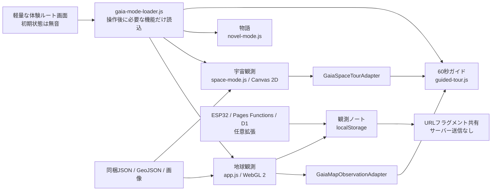

# GAIA SENSATION アーキテクチャ

この文書は、審査時に追いやすい範囲へ絞った実行構成、主要イベント、内部アダプターの一覧です。作品の詳細仕様はREADMEと各データ台帳を参照してください。

## 実行構成

初期HTMLは入口に必要なCSS、JavaScript、ブランド画像だけを読みます。音声、物語画像、地球・宇宙の観測JSON、3D／Canvas機能、ガイド、観測ノートは選択後に読み込みます。

## 公開URLと入口

| URL | 動作 |
|---|---|
| `/` | 初回は4つの選択肢、再訪は「前回の続き」を追加表示 |
| `#tour` | 入口と映画的オープニングを迂回し、60秒ガイドを開始 |
| `#story` | 入口を迂回し、物語の入口へ移動 |
| `#earth` ほか展示ハッシュ | 入口を迂回し、指定した展示へ移動 |
| `#observation=<payload>` | 入口を迂回し、共有観測を読み取り専用で開く |

入口の選択は `gaiaSenseware:entryPreference:v1` に `version`、`visited`、`lastRoute`、`soundEnabled` だけを保存します。書き込みに失敗した場合は初回・無音へ戻します。音量は既存の保存キーを継続利用します。

## 遅延読込グループ

| グループ | 主な内容 | 読み込む契機 |
|---|---|---|
| `exploration` | 9展示、地図、データ台帳 | 自由探索、ガイド、展示の直接URL |
| `space` | 宇宙10展示、保存済み宇宙データ | 宇宙を開く、ガイドの宇宙工程 |
| `story` | 物語UI、セーブ、物語画像 | 「物語から始める」、`#story` |
| `tour` | ガイドUIと進行制御 | 「60秒で地球を感じる」、`#tour` |
| `notebook` | 保存、比較、共有 | 観測ノートを開く、共有URL |

## 主要アダプター

| アダプター | 役割 |
|---|---|
| `GaiaMapObservationAdapter` | データ準備待機、展示選択、年代変更、地図開閉、操作対象の強調、ソースタブ表示、現在値と変換情報の取得 |
| `GaiaSpaceTourAdapter` | 準備完了待機、宇宙展示選択、信号再生、操作対象の強調、現在値と変換情報の取得、終了 |
| `GaiaGuidedTour` | 7工程・60秒の進行、一時停止、前後移動、終了、再入場、非表示タブ停止 |
| `GaiaObservationNotebook` | 正規化した観測の保存、最大24件、比較、削除、共有の読込 |

アダプターは既存展示の計算結果を読み取ります。ガイド専用の別計算は持たず、地図・宇宙の「変換レシート」と同じ値を表示します。

## 主要イベント

| イベント | 用途 |
|---|---|
| `gaia:initial-view-ready` | 軽量入口の表示準備完了 |
| `gaia:opening-complete` | 選択したルートの遅延読込と画面切替完了 |
| `gaia:app-ready` | 地球観測UI準備完了。WebGL 2不可時も静的フォールバックを通知 |
| `gaia:map-adapter-ready` | 地図アダプター利用可能 |
| `gaia:space-tour-adapter-ready` | 宇宙アダプター利用可能 |
| `gaia:guided-tour-ready` | ガイド利用可能 |
| `gaia:space-open` / `gaia:space-close` | 宇宙レイヤーの開始／破棄 |

## 耐障害性とライフサイクル

- WebGL 2が使えない場合も、静的な数値・変換説明、出典、ガイド終了先を操作できます。
- 観測JSONや宇宙表示の読込に失敗した工程は同じ区分・単位・提供元を持つ静的カードへ切り替え、ガイドを止めません。
- `visibilitychange` で地図、宇宙、音響の描画ループを停止し、再表示時だけ再開します。
- 開閉処理は既存インスタンスを再利用し、Canvasや音声プレイヤーを追加生成せず、閉じる際に描画フレームを解除します。
- ガイドはセーブデータと観測ノートを書き換えません。
- 共有観測はURLフラグメント内だけに置き、端末ID、所有者、プロフィール、正確な位置情報を含めません。
