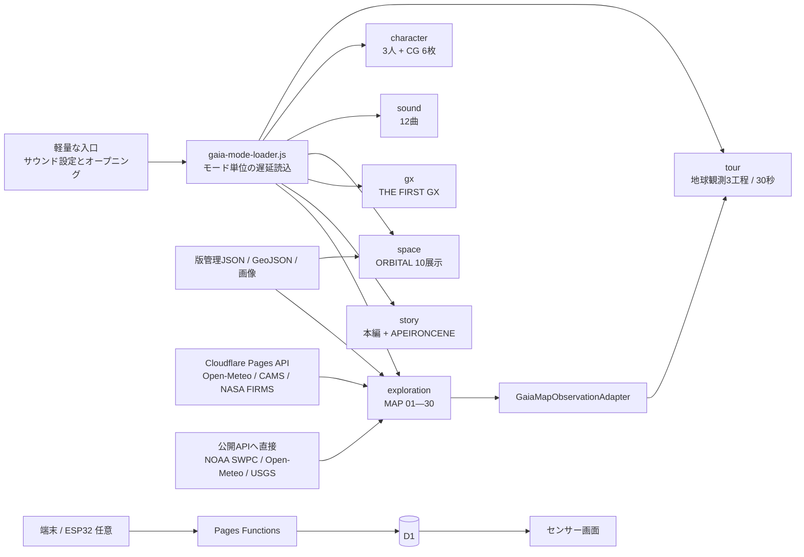

# GAIA SENSEWARE アーキテクチャ

この文書は実装を審査・保守時に追いやすい単位へ整理したものです。2026-09-06にデータ取得経路とキャッシュ・取得失敗時の説明を実装と照合しました。作品内容は[README](../README.md)、応募時の確認順は[コンテスト提出ガイド](CONTEST_2026_SUBMISSION.md)、データ利用条件は[外部データ監査](EXTERNAL_DATA_USAGE_AUDIT.md)を参照してください。

## 実行構成



初期HTMLは入口に必要なCSS、JavaScript、ブランド画像、キービジュアルだけを読みます。音声、物語背景、地図・宇宙の観測JSON、WebGL／Canvas機能、キャラクター画像、ガイドは選択後に読み込みます。

## 公開URLと入口

| URL | 動作 |
|---|---|
| `/` | サウンド設定、オープニング、物語／データ探索の2択を表示 |
| `#tour` | 入口を迂回し、地球観測の30秒ガイドを開始 |
| `#story` または `/story` | 入口を迂回し、物語のタイトルへ移動 |
| `#earth` / `#japan` / `#data` | explorationを読み、対応する地球観測画面へ移動 |
| `#character` | explorationとcharacterを読み、登場人物の記録を開く |
| `#sound` | soundだけを読み、音楽アーカイブを開く |
| `?space=1` | explorationとspaceを読み、ORBITALを開く |

入口のルート選択は保存しません。再訪時は同じ作品入口から始めます。音量、物語の進行、既読状態は用途ごとのローカル保存キーを使用します。

## 遅延読込グループ

| グループ | 主な内容 | 読み込む契機 |
|---|---|---|
| `exploration` | MAP 01—30、地図、データ台帳、ライブ取得、統計、LOD | データ探索、地球観測の直接URL、ガイド |
| `story` | 本編6章、APEIRONCENE、SAVE／LOAD、背景・演出 | 物語開始、`#story` |
| `gx` | `THE FIRST GX` | GXカードまたは物語内のGX工程 |
| `space` | ORBITAL 10展示、保存済み宇宙データ | 宇宙を開く、`?space=1` |
| `sound` | 12曲、プレイヤー、音反応ビジュアライザー | 音楽カード、`#sound` |
| `character` | 3人の設定、表情、CGアルバム6枚 | キャラクターカード、`#character` |
| `tour` | 地球観測3工程の案内UI | `#tour` |

## MAPの実装境界

| 番号 | 主な実装 | データ経路 |
|---|---|---|
| 01—09 | `app.js`, `app-content.js` | `data/gaia-signals.json` 等の版管理データ。01のオーロラ層はNOAA SWPC OVATIONと保存値を切替 |
| 10—15 | `src/exploration/live-exhibits.js`, `live-data.js` | `/api/live/v1/snapshot`、`/stream`、`/wind-field`。表示値はOpen-Meteo／CAMS |
| 21—30 | `src/exploration/estat-exhibits.js`, `estat-exhibit-catalog.js` | 統計局・国土交通省・観光庁・気象庁の長期年次値 `data/estat-prefecture-series.json`。月次の旧モジュールは年次展示のフォールバックに使わない |
| 26 | `src/exploration/firms-exhibit.js` | `/api/live/v1/firms`。NASA FIRMS取得失敗時は `data/firms-active-fire-snapshot.json` |
| 27—30 | `src/exploration/planet-signals-exhibit.js` | Open-Meteo Forecast／Air Qualityの全球240サンプル点とUSGS全地震フィードへブラウザから直接接続 |

公開版は保存済みデータと外部APIを併用します。外部JavaScriptランタイムライブラリを使わないことは、外部データAPIへ接続しないことを意味しません。保存JSONだけを表示する展示があっても、ページ全体の外部通信を無効にする設定ではありません。

MAP 21—30の年次期間・母集団・品質フラグ・再生成とテストは[長期年次系列](PREFECTURE_ANNUAL_HISTORY.md)を参照。分析は選択中の県・観測地点の年系列を受け取り、欠測年を除外する。

MAP 10—15・26のPages APIはCloudflare Cache APIを使用し、D1へこれらの観測値を保存しません。MAP 27—30は5分のタブ内キャッシュ（`sessionStorage`）を使い、外部取得値をファイルへ書き出しません。

### 取得状態の読み方

取得状態は通信・再利用の状態であり、`SOURCE / DERIVED / SCENARIO` という加工・仮定の区分とは別です。`LIVE` や `LIVE CACHE` は最新性、常時更新、実測値であることを保証しません。気象・大気質はモデル値を含み、取得した時刻とデータ自体の時刻は異なります。

| 対象と表示 | 現行実装での意味 | 取得できない場合 |
|---|---|---|
| MAP 01 オーロラ層 | NOAA SWPCへ直接取得。5分間隔で再取得を試行 | 同梱のOVATIONスナップショット。これも読めなければ利用不可 |
| MAP 10—15 ライブ／保存・取得状態 | サイト側APIから都市別の値を取得。天気30分、大気質3時間、風速場5分を基準にサーバーでキャッシュ。SSE接続自体は新しい観測の保証ではない | 最後の取得値、対応地点の同梱保存値、または欠測。東京用保存値を他都市の実測として流用しない |
| MAP 26 `LIVE CACHE` | APIが返す `source: nasa-firms-modis`。新規取得と15分以内のサーバーキャッシュを同じ表示で扱う。ブラウザは読込済みの値を保持するため、15分ごとの画面更新を保証しない | `source: stale-cache` または `snapshot` を `SAVED SNAPSHOT` と表示 |
| MAP 27—30 `LIVE` | APIへの直接取得に成功 | 有効なキャッシュがなく取得にも失敗した場合は下記のサンプル値 |
| MAP 27—30 `LIVE CACHE` | 取得後5分以内のタブ内キャッシュを再利用。展示選択時に有効期限を判定し、常時ポーリングしない | 期限切れなら再取得を試行 |
| MAP 27—30 `SAVED VALUES` | コード内の演出用サンプル。過去の実測を保存したデータではない | サンプルは統計分析の対象外 |

MAP 26の `SAVED SNAPSHOT` は、期限切れAPIキャッシュと版管理スナップショットを表示名だけでは区別できません。API応答の `source` / `fallbackReason` で区別し、画面ではデータ時刻と経過時間も確認します。現在のラベルを、すべての取得状態を一対一に区別するものとは説明しません。

照合先: `app.js` の `loadOvationAuroraForecast`、`src/exploration/live-data.js`、`src/exploration/firms-exhibit.js` の `loadSnapshot` / `renderSnapshot`、`src/exploration/planet-signals-exhibit.js` の `readCache` / `loadData`、`sensor-platform/src/live-senseware.ts` のキャッシュ・フォールバック処理。作品内の対応説明は `index.html` の `#architecture-data-policy` にあります。

MAP 10—25は、固定データと画面の実行処理を分離しています。以下はすべて `src/exploration/` 内のモジュールです。

- `observation-cities.js`: 47都道府県の代表地点と前後の地点を求める処理。ライブ展示と公的統計展示で共有します。
- `live-exhibit-catalog.js` / `estat-exhibit-catalog.js`: 展示ID、表示文言、単位、出典などの固定定義。ブラウザや地図を起動せずに読み込めます。
- `live-exhibits.js` / `estat-exhibits.js`: 地図への描画、イベント処理、再生状態。固定データを使うためだけに別の描画モジュールを読み込みません。

`scripts/check-exhibit-catalog.mjs` で定義・地点順序・共有依存を検査し、`scripts/check-live-next-16-browser.mjs` でモジュールの重複読込、展示境界、地点の前後移動と自動巡回を確認します。

地図の「デモ」は通常の地図入場時（再入場を含む）に初期オンとなり、全30展示を25秒間隔で巡回します。`map-demo-controller.js` が単一の期限タイマー、周回、停止、残り時間保持を担当し、`map-demo.js` が既存の展示ボタンに接続します。地図ガイド中と非表示タブではオンを保ったまま切り替えを一時停止し、両方が解除されると残り時間から再開します。訪問者の地図操作・地図退出・分析画面などの開始で停止し、同じ入場中は勝手に再開しません。ガイドの再表示は手動オフを維持し、物語内の地図ではデモを自動開始しません。音量やミュート設定は変更しません。`scripts/check-map-demo.mjs` と `scripts/check-map-demo-browser.mjs` で確認します。

地図の初回ガイド（セッションごとの `map:v4`）は、現在の展示UIが準備できてから、左下の展示選択 → 観測値 → 時間 → 出典 → 統計分析 → 凡例 → デモの順に案内します。スマホでは展示一覧・読み方・操作の各ボタンへ案内先を切り替えます。共有の `mode-entry-guide.js/css` が「次へ・戻る・閉じる」、フォーカス管理、画面内配置とデモに通知する開閉イベントを担当します。`scripts/check-map-guide-demo-browser.mjs` で6画面サイズの配置、ガイド中の切り替え停止、再入場、物語内の除外を確認します。

MAP 01〜05は下部ドックの共通「リアルタイム展示」表示を主役とし、`realtime-exhibit-status.js` と `realtime-exhibits.css` で接続状態・データ時刻（JST）・提供元・衛星観測／モデル値の区分を常時表示します。NASA FIRMSの保存観測、生成した参考値、取得失敗、24時間を超えるデータ時刻の遅れはLIVEとは別の状態で表示します。生成した参考値の時刻は現在の観測時刻として表示しません。時刻の経過による状態表示だけを1分ごと・タブ復帰時に再評価し、データ取得頻度の変更や自動ポーリングは行いません。右上の平均値・凡例・出典詳細は開閉式にまとめ、MAP 06以降にはリアルタイム表示を出しません。`check:realtime-exhibits` と `check:realtime-exhibits:browser` で確認します。

## 主要アダプター

物語本文の改行・改ページは `novel-mode.js` で実表示幅を測って決めます。1ページ最大3行とし、送りマークが本文の右にある場合は横方向の安全距離も評価します。語句単位で最少行数を保ちつつ句読点での改行を優先し、カタカナ語・数値と単位・語尾の分断を避けます。表示用の改行と台本の改行は区別し、本文・読み上げ用テキスト・文字送り順序を維持します。`scripts/check-dialogue-flow.mjs` と `scripts/check-dialogue-pagination-browser.mjs` で行割り・全本文・狭い画面・分かち書きなしのフォールバックを検査します。

| アダプター | 役割 |
|---|---|
| `GaiaMapObservationAdapter` | データ準備待機、展示選択、年代変更、地図開閉、操作対象の強調、ソースタブ表示、現在値と変換情報の取得 |
| `GaiaGuidedTour` | 地図・年代・変換の3工程／30秒。一時停止、前後移動、終了、再入場、非表示タブでの停止 |
| `GaiaSpaceTourAdapter` | ORBITALの展示選択、信号再生、強調、値と変換情報の取得。現在の30秒ガイドからは呼び出さない |

ガイドは既存展示の計算結果を読み取ります。ガイド専用の観測値や別計算は持ちません。

## 主要イベント

| イベント | 用途 |
|---|---|
| `gaia:initial-view-ready` | 直接URLを含む初期表示の準備完了 |
| `gaia:opening-complete` | 選択ルートの遅延読込と画面切替完了 |
| `gaia:app-ready` | 地球観測UI準備完了。WebGL 2不可時も静的フォールバックを通知 |
| `gaia:map-adapter-ready` | 地図アダプター利用可能 |
| `gaia:guided-tour-ready` | ガイド利用可能 |
| `gaia:novel-open` / `gaia:novel-open-at-mode` | 物語を開始、または指定章から開く |
| `gaia:novel-background-transition-complete` | 背景・セパレーターを準備した場面転換の完了 |
| `gaia:live-update` / `gaia:live-wind-field` | MAP 10—15向けの正規化イベント／47地点風速場 |
| `gaia:live-exhibit-change` | MAP 10—15の選択変更 |
| `gaia:estat-exhibit-change` | MAP 16—25の選択変更 |
| `gaia:firms-exhibit-change` | MAP 26の開始／終了 |
| `gaia:planet-signals-change` | MAP 27—30の選択と取得状態の変更 |
| `gaia:space-open-at-mode` / `gaia:space-close` | ORBITALの開始／破棄 |
| `gaia:lodchange` | `high / medium / low / static` の描画品質変更 |

## Pages API

`sensor-platform/src/live-senseware.ts` が次の読み取り専用経路を処理します。

| Endpoint | 用途 |
|---|---|
| `GET /api/live/v1/snapshot?city=...` | 選択都市の天気・大気モデル値と利用可能な補助providerイベント |
| `GET /api/live/v1/stream?city=...` | snapshot／provider／statusイベントとheartbeatを送るSSE |
| `GET /api/live/v1/wind-field` | 47都道府県代表都市の風速モデル値 |
| `GET /api/live/v1/firms` | NASA FIRMS全球24時間の火災・熱異常 |

MAP 10—15の表示カードが使う値はOpen-Meteo ForecastとOpen-Meteo Air Quality／CAMSです。WorkerにはNOAA NDBC／GML、および機能フラグ付きJAXA GSMaP／ESA Sentinel-5Pのproviderアダプターも残っていますが、現在の6カードの表示値としては使いません。

- `LIVE_SENSEWARE_ENABLED=true` のとき上流取得を行い、失敗時はキャッシュまたは版管理スナップショットへ退避
- 風速場は5分、天気は30分、CAMS大気質は3時間、FIRMSは15分を基準にキャッシュ
- SSEは非表示タブで閉じ、復帰時にsnapshotを取り直してから上限付きバックオフで再接続
- FIRMSのAPIキーはクライアントへ配布しない

## 物語データと場面転換

```text
story/USER_SCRIPT_2026-08-24.txt
  -> story/APPROVED_SCRIPT_2026-08-24.md
  -> novel-story-data.js / true-end-data.js
  -> story/現行統合台本.md
```

入力、生成物、統合台本の役割は[story/README.md](../story/README.md)に記載しています。新規開始や章送りでは、次の背景をプリロードして描画可能な状態にし、必要な章セパレーターを出してからフェードを進めます。基礎WebGL背景や無地の画面が一瞬露出しないことを専用ブラウザテストで検査します。

## 動的LOD

- `GaiaFrameBudgetGovernor` はフレーム時間のp95を測り、DPR、粒子数、効果を段階調整します。
- 現在の品質は `data-gaia-lod` と `gaia:lodchange` で確認できます。
- 非表示タブでは地図、物語演出、宇宙、音響の描画ループを停止し、表示復帰時だけ再開します。

## 耐障害性とライフサイクル

- WebGL 2が使えない場合も、静的な数値、変換説明、出典、ガイド終了先を操作できます。
- 外部APIの読込失敗時は、展示ごとに過去の取得値、保存スナップショット、演出用サンプル、欠測を使い分けます。詳細は「取得状態の読み方」を参照してください。保存ファイル自体も読み込めない場合があり、初回を含む完全オフライン動作を保証する構成ではありません。
- 開閉処理は既存インスタンスを再利用し、Canvasや音声プレイヤーを重複生成しません。
- 物語への新規遷移はベース画面を先に隠し、フェードアウト後に物語をフェードインします。
- ガイドは物語のセーブデータを書き換えません。
- CIは検査だけを行い、pushやデプロイを実行しません。
