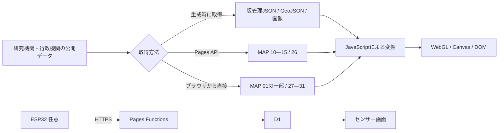

# ZEN Study プログラミングコンテスト2026 夏 — 審査ガイド

## 30秒で確認する

- 作品: **惑星の放課後 — GAIA SENSATION / GAIA SENSEWARE**
- 応募区分: Webページ部門
- 公開サイト: <https://gaia-senseware.pages.dev/>
- 30秒ガイド: <https://gaia-senseware.pages.dev/#tour>
- GitHub: <https://github.com/hinahina-vr/gaia-senseware>
- 公式要項: <https://progedu.github.io/webappcontest/2026/summer/index.html>

`#tour` は映画的オープニングを迂回し、「30秒で基本操作を覚える」ガイドを開始します。10秒ずつ、地図を動かして観測点を選ぶ、年代を動かす、`SOURCE / DERIVED / SCENARIO` の変換過程を開く、という3工程を実画面で案内します。一時停止、前後移動、途中終了が可能です。

通常URLはサウンド設定とオープニングから始まり、最後に `物語をはじめる` と `データを探索する` の2つを提示します。再訪時も同じ入口を表示し、前回選んだルートへ自動遷移しません。

## 作品の要点

公開データを鑑賞用の光・色・動き・音へ変換し、数値の出典と加工を確認しながら地球の変化をたどるブラウザ作品です。逗子海岸の展示会で初めて会う女子学生3人の物語、ESP32を使う参加型センサー、宇宙観測、キャラクター資料、音楽アーカイブも同じ世界に接続しています。

| モード | 審査時に確認できるもの |
|---|---|
| MAP | 31展示。保存データ、国内統計、現在のモデル値、直近24時間の観測を同じ地図UIで比較 |
| STORY | 本編6章・372ステップと、解放後のAPEIRONCENE 3章・133メッセージ |
| SENSOR | 端末・ESP32から参加する任意拡張。利用しなくても基本体験は完結 |
| CHARACTER | 3人の設定・表情と物語CG6枚 |
| SOUND | 12曲と音に反応するビジュアライザー |
| GX | 酸素と生命の歴史を扱う `THE FIRST GX` |
| ORBITAL | 保存済み宇宙データを使う10の観測窓 |
| TOUR | 地図・年代・データ変換を案内する30秒ガイド |

基本体験はHTML、CSS、JavaScript、WebGL 2、Canvas 2D、Web Audio API、ブラウザ標準APIで動作します。ブラウザへ外部JavaScriptランタイムライブラリを配信しません。TypeScriptとWranglerは、参加型センサーとPages APIの開発・検査にだけ使用します。

## MAP 31展示とデータ経路

| 番号 | 内容 | データの状態 |
|---|---|---|
| 01—09 | CO₂、海流、森林・降水、資源化、排出・夜間光、地震、生態系、再生可能電力、人口 | 主に版管理スナップショット。01のオーロラ層だけはNOAA SWPC OVATIONを直接取得し、失敗時に保存値へ切替 |
| 10—15 | 風、CO₂、降水、気温、雲量、PM2.5 | Pages API経由のOpen-Meteo／CAMS。JPTのデータ時刻と取得状態を表示 |
| 16—25 | 人口移動、宿泊、住宅着工、気温3種、湿度、日照、降水、雨日数 | e-Stat／気象庁から生成した47都道府県スナップショット。閲覧時の外部API通信なし |
| 26 | NASA FIRMSの火災・熱異常 | Pages API経由。UTCの最新観測時刻と経過時間を表示し、失敗時は保存値へ切替 |
| 27—31 | 全球の風・気圧、波、大気質、地震、太陽風 | Open-Meteo、USGS、NOAA SWPCへブラウザから接続。UTC時刻、経過時間、5分キャッシュ／保存値を区別 |



外部通信に失敗しても、基本UIと保存データで展示を継続します。ライブ値、キャッシュ、保存値は画面上で区別し、保存値を現在の観測として見せません。

## 審査時の確認項目

| 項目 | 確認方法 |
|---|---|
| 初見導線 | 通常URLでサウンド有無を選び、オープニング後の物語／データ探索を確認 |
| 再訪導線 | 再読込しても同じ入口から始まり、前回ルートへ自動遷移しないことを確認 |
| 直接URL | `#tour`、`#story`、`#earth` はオープニングを迂回 |
| 地球観測 | `#tour` または「データを探索する」→「世界を観測する」 |
| 出典・変換 | 地図の `OPEN DATA` と `CODE`。元データ、計算、描画への割当を確認 |
| ライブ時刻 | MAP 10—15はJPT、26—31はUTCのデータ時刻・経過時間・取得状態を確認 |
| 国内統計 | MAP 16—25で47都道府県と時系列を切替 |
| 物語 | `#story` で本編を開始。AUTO、LOG、SAVE／LOAD、章送りを確認 |
| モバイル | Chromeの縦画面・短い横画面でサウンド設定、入口、地図、ガイドを操作 |
| GitHub・テスト | Actionsの `Contest checks` と下記コマンドを確認 |

## 実装と検査

入口ではキービジュアルとサウンド設定に必要な資産だけを読みます。MAP、STORY、GX、ORBITAL、SOUND、CHARACTER、TOURは操作後にモード単位で遅延読込します。音声、物語背景、観測JSONを初期表示時に一括転送しません。

```powershell
npm run check
npm run check:contest
npm run check:rights
npm --prefix sensor-platform run typecheck
npm --prefix sensor-platform run check:pages-worker
npm --prefix sensor-platform run test:pages
```

`check:contest` は初期画面の保守的な未圧縮合計1MB以下、操作前の大型資産読込禁止、公開メディアの権利台帳、この提出ガイド、CI設定を検査します。GitHub ActionsはUbuntu上の実Google Chromeで、PC、4種類のモバイル幅、WebGL無効、直接URL、履歴・再読込、モードの反復開閉、JavaScriptエラー、未処理Promise、404を検査し、失敗時成果物を14日間保存します。

## データの表示ルール

- `SOURCE` — 提供元が公開した観測・統計・モデル値
- `DERIVED` — 正規化、補間、集計、回帰、表示用の計算
- `SCENARIO` — 観客操作または明記した仮定による試算
- ライブ系はデータ時刻、取得時刻、経過時間、状態を分けて表示
- 欠測は0として扱わず、補完した箇所には `DERIVED` を付ける
- 未来投影は観測値と混ぜず、モデルの仮定・期間・限界を表示
- 火災の光点はNASA FIRMSの熱異常代表点であり、火災範囲や焼失面積ではない
- 地震の波紋は震度分布や被害範囲ではない
- 気象・海洋モデル値は公式警報、航海情報、健康判断には使用しない

## データ出典

| 分野 | 主な提供元 | 作品内での用途 |
|---|---|---|
| CO₂・気温 | GOSAT / NIES、NOAA GML、NASA GISTEMP、CAMS、Open-Meteo | 全球CO₂、長期系列、気温偏差、現在のモデル値 |
| 海流・気象・海洋 | NOAA CoastWatch、NASA POWER、Open-Meteo Forecast / Marine | 海面流、風、降水、雲、日射、波 |
| 大気質 | Open-Meteo Air Quality / CAMS | PM2.5、エアロゾル光学的厚さ |
| 森林・夜間光 | NASA MODIS、NASA VIIRS | 森林域、夜間光 |
| 生物間関係・観察 | GloBI、GBIF | 花粉媒介関係、観察記録 |
| 資源・都市・エネルギー | UN SDG、Global Carbon Project / CICERO、World Bank | 再資源化、排出、都市人口、再生可能電力 |
| 国内統計 | e-Stat、総務省、観光庁、国土交通省、気象庁 | 人口移動、宿泊、住宅着工、気温・湿度・日照・降水 |
| 火災・地震 | NASA LANCE FIRMS、気象庁、USGS | 直近24時間の熱異常、国内震度履歴、世界の地震 |
| 宇宙 | NASA DONKI、NASA/JPL CNEOS、NASA Exoplanet Archive、ISAS/JAXA DARTS、NOAA SWPC | 太陽活動、小天体、系外惑星、リュウグウLIDAR、太陽風 |
| 文化 | UNESCO World Heritage Centre | 三つの生態系の文化例 |
| 地図 | Natural Earth 1:50m Land / Countries、国土地理院 | 世界地図、国境、都道府県境界 |

公式URL、取得日時、期間、単位、解像度、加工、注意事項は作品内の `OPEN DATA` と[外部データ監査](EXTERNAL_DATA_USAGE_AUDIT.md)で確認できます。同監査の `要対応` 項目が残るため、全データを無条件に再配布可能とは表明していません。

## 制作素材と権利表記

- 背景美術・キャラクター等のラスター素材: OpenAI ImageGenで制作。生成方法とハッシュは各 `*-RIGHTS.md` と台帳に記録。
- 音楽: オープニングテーマ『Planet Forecast - Hope』、エンディングテーマ『AfterSchool, AfterGlow』ほか、主にSuno AIで制作。作品内スタッフロールにも表示。
- 地図: Natural Earth 1:50m Land / Countries（Public Domain）。
- 科学・統計データ: 提供元の利用条件へリンクし、元の値と作品内変換を分けて表示。
- 機械可読台帳: `docs/media-rights-ledger.json`。人間向け: `docs/MEDIA_RIGHTS_LEDGER.md`。
- コードの利用条件: `LICENSE.md`。データとメディアはそれぞれの個別条件に従う。

## GitHubと公開版の一致

応募時は公開GitHubの `main` が指すコミットから配布物を作り、その同一ツリーだけをCloudflare Pagesへ公開します。公開前にコミットSHA、テスト結果、権利台帳、公開URLの主要ファイルを確認します。CIやローカル検査から自動デプロイは行いません。
