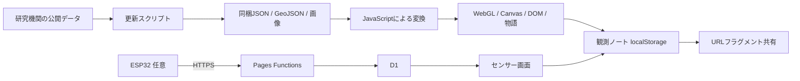

# ZEN Study プログラミングコンテスト2026 夏 — 審査ガイド

## 60秒で確認する

- 作品: **惑星の放課後 — GAIA SENSATION**
- 応募区分: Webページ部門
- 公開サイト: <https://gaia-senseware.pages.dev/>
- 60秒ガイド: <https://gaia-senseware.pages.dev/#tour>
- GitHub: <https://github.com/hinahina-vr/gaia-senseware>
- 公式要項: <https://progedu.github.io/webappcontest/2026/summer/index.html>

初回画面の「60秒で地球を感じる」、または上記の `#tour` URLを使うと、実際の地球観測地図、年代スライダー、データ変換パネル、宇宙観測を操作しながら作品全体を確認できます。ガイドは60秒で自動進行し、一時停止、前後移動、終了も可能です。

## 作品と実装

公開データを鑑賞用の色・動き・音・物語へ変換し、地球観測を「読む」だけでなく「感じ、測り、残す」体験にしたブラウザ作品です。基本体験はHTML、CSS、JavaScript、WebGL 2、Canvas 2D、ブラウザ標準APIだけで動作し、外部JavaScriptランタイムライブラリを読み込みません。

ESP32、Cloudflare Pages Functions、D1は参加型センサー機能の任意拡張です。センサー、ログイン、外部API接続がなくても、9展示、物語、宇宙モード、60秒ガイドを最後まで体験できます。TypeScriptとWranglerはセンサーAPIの開発・検査用で、応募Webページのブラウザランタイムには含まれません。



科学データの閲覧中は外部データAPIへ接続せず、リポジトリへ保存したスナップショットを読みます。表示では `SOURCE`（公開記録）、`DERIVED`（正規化・補間・計算）、`SCENARIO`（仮定や観客操作による状態）を区別しています。

詳細な遅延読込、主要イベント、地図・宇宙アダプター、保存キー、障害時の経路は[アーキテクチャ文書](ARCHITECTURE.md)で確認できます。

## 審査時の確認項目

| 項目 | 確認方法 |
|---|---|
| 初見導線 | 体験ルート画面から「60秒で地球を感じる」。初期状態は無音で、音設定は任意 |
| 再訪導線 | 「前回の続き」から前回選んだガイド／物語／探索へ戻る。自動遷移はしない |
| 直接URL | `#tour`、`#story`、`#earth`、`#observation=...` は体験ルート画面を迂回 |
| 地球観測 | ガイド、または「データを探索する」→「世界を読む」 |
| 出典・変換 | 地図の `OPEN DATA` と `CODE`、READMEのデータ開示原則 |
| 観測の保存 | 世界地図の「この時点を保存」、ESP32履歴の「観測ノートに保存」 |
| 比較・共有 | 観測ノートで2件を選択。共有値はURLフラグメント内だけに保存 |
| モバイル | Chromeの縦画面・短い横画面で体験ルート画面とガイドを操作 |
| GitHub・テスト | Actionsの `Contest checks` と下記コマンド |

```powershell
npm run check
npm run check:contest
npm --prefix sensor-platform run typecheck
npm --prefix sensor-platform run check:pages-worker
npm --prefix sensor-platform run test:pages
```

`check:contest`は、初期画面の保守的な未圧縮合計1MB以下、操作前の大型資産読込禁止、観測ノートの24件制限・比較・URL共有・非公開項目除去、この提出ガイドとCI設定を検査します。ブラウザ試験はPC、280〜390px幅の縦画面、320〜390px高の横画面、低モーション設定を対象にします。

## データ出典

| 分野 | 主な提供元 | 作品内での用途 |
|---|---|---|
| CO₂・気温 | GOSAT / NIES、NOAA GML、NASA GISTEMP | 全球CO₂、長期系列、気温偏差 |
| 海流・気象 | NOAA CoastWatch、NASA POWER | 海面流、風、降水、日射条件 |
| 森林・夜間光 | NASA MODIS、NASA VIIRS | 森林域、夜間光 |
| 生物間関係・観察 | GloBI、GBIF | 花粉媒介関係、観察記録 |
| 資源・都市・エネルギー | UN SDG、EDGAR、World Bank | 再資源化、排出、都市人口、再生可能電力 |
| 地震 | 気象庁、USGS | 国内震度履歴、世界の大地震 |
| 文化 | UNESCO World Heritage Centre | 三つの生態系の文化例 |
| 宇宙 | NASA DONKI、NASA/JPL CNEOS、NASA Exoplanet Archive、ISAS/JAXA DARTS | 太陽活動、小天体、系外惑星、リュウグウLIDAR |
| 地図 | Natural Earth 1:50m Land | 世界地図の陸地輪郭（Public Domain） |

各データセットの公式URL、取得日時、期間、単位、解像度、加工、注意事項、プレビューは作品内の `OPEN DATA` とリポジトリのデータ生成・検査コードで確認できます。

## 制作素材と権利表記

- 背景美術・キャラクター等のラスター素材: OpenAI ImageGenで制作。採用素材の生成方法とハッシュは各 `*-RIGHTS.md` および素材台帳に記録。
- 音楽: オープニングテーマ『Planet Forecast - Hope』、エンディングテーマ『AfterSchool, AfterGlow』、by Suno AI。作品内スタッフロールにも表示。
- 地図: Natural Earth 1:50m Land（Public Domain）。
- 科学・統計データ: 上記提供機関の公開資料・利用条件へリンクし、値の出典と作品内変換を分けて表示。

## GitHubと公開版の一致

応募時は公開GitHubの `main` が指す同一コミットから配布物を作り、その配布物だけをCloudflare Pagesへ公開します。公開前に `git rev-parse origin/main`、配布物の保護対象除外、テスト結果、公開URLの主要ファイルを確認し、GitHub上のコードと審査URLが一致する状態で提出します。CIやローカル検査から自動デプロイは行いません。
